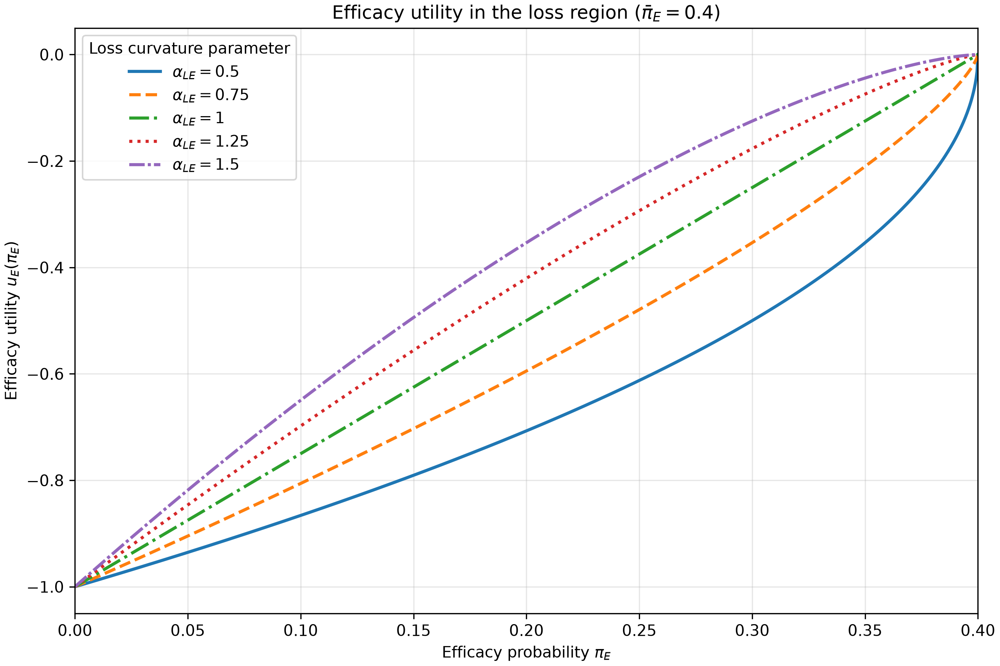

# utility-function-plots
Plots and visualizations of utility functions for efficacy and toxicity in dose-finding studies

## Efficacy loss utility plot

Install the dependency and run the script:

```bash
python -m pip install -r requirements.txt
python plot_efficacy_loss.py
```

The script saves `efficacy_loss_utility.png` beside the script at 300 dpi.
Use `--output /path/to/plot.png` to choose another location. No graphical
display is required.

It plots `u_E(pi_E) = -((0.4 - pi_E) / 0.4)^alpha_LE` on `[0, 0.4]`
for `alpha_LE = 0.5, 0.75, 1.0, 1.25, 1.5`. The threshold endpoint
is included by continuity: every curve goes from utility −1 at zero
efficacy to utility 0 at the threshold.

**Interpretation:** For this formula, `alpha_LE < 1` produces a convex
curve and a more negative utility (larger penalty) than the linear
`alpha_LE = 1` curve. `alpha_LE > 1` produces a concave curve and a less
negative utility (smaller penalty). Thus the “forgiving below 1 / strongly
penalizing above 1” interpretation is reversed for the specified formula.


